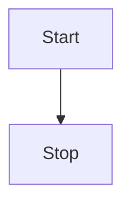

# 计算机组成原理知识-学习我见-by zobol

#### 写作前言
[ 希望这是一场趣味之旅-作者想法](./Doc/AuthorForeword/01WangShiRuYan.html)  

[ 为什么要学计算机组成原理？](./Doc/AuthorForeword/02NiHaoComputerNetwork.html)


#### 总述

#### 1.物理层
[1.1 物理层是做什么的？](b.html)
#### 2.数据链路层
#### 3.网络层
#### 4.传输层
#### 5.应用层


* * *
是的**发射**点
```chart
,Budget,Income,Expenses,Debt
June,5000,8000,4000,6000
July,3000,1000,4000,3000
Aug,5000,7000,6000,3000
Sep,7000,2000,3000,1000
Oct,6000,5000,4000,2000
Nov,4000,3000,5000,

type: bar
title: Monthly Revenue
x.title: Amount
y.title: Month
y.suffix: $
```




|  |  |  |  |  |
| --- | --- | --- | --- | --- |
|  |  |  |  |  |
|  |  |  |  |  |
|  |  |  |  |  |
|  |  |  |  |  |

`发
```chart
,Budget,Income,Expenses,Debt
June,5000,8000,4000,6000
July,3000,1000,4000,3000
Aug,5000,7000,6000,3000
Sep,7000,2000,3000,1000
Oct,6000,5000,4000,2000
Nov,4000,3000,5000,

type: pie
title: Monthly Revenue
x.title: Amount
y.title: Month
y.suffix: $
```
`

