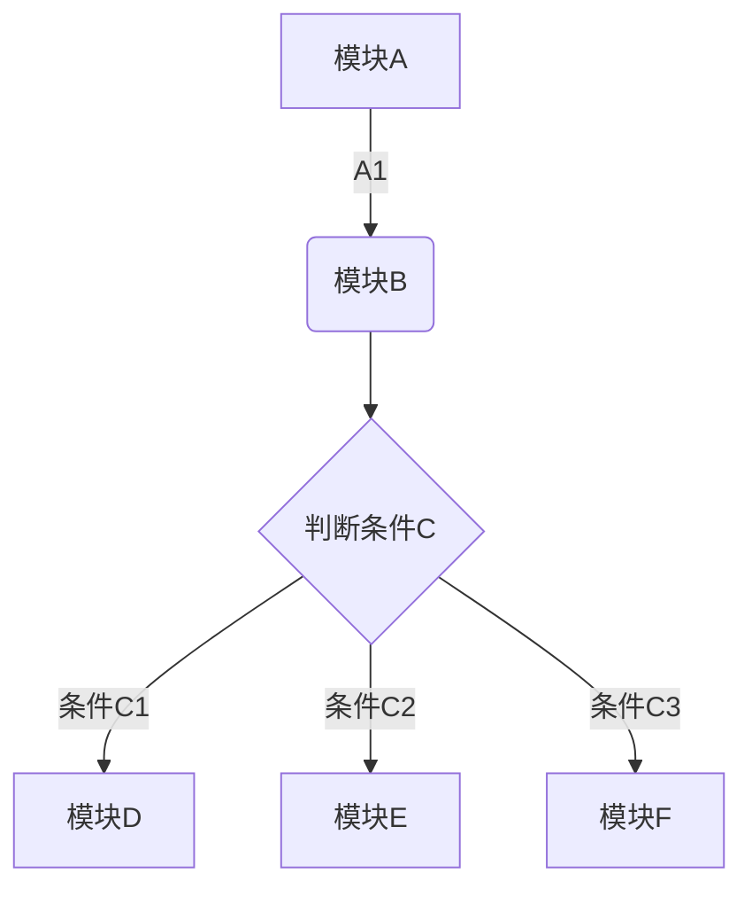

# 计算机网络知识-学习我见-by zobol

#### 写作前言
[ 往事如烟-作者自序](./Doc/AuthorForeword/01WangShiRuYan.html)  

[ 你好呀，计算机网络！](./Doc/AuthorForeword/02NiHaoComputerNetwork.html)

#### 总述
#### 1.物理层

[1.1 物理层是做什么的？](b.html)

[1.2 物理层是做什么的？](b.html)

#### 2.数据链路层
#### 3.网络层
#### 4.传输层
#### 5.应用层

